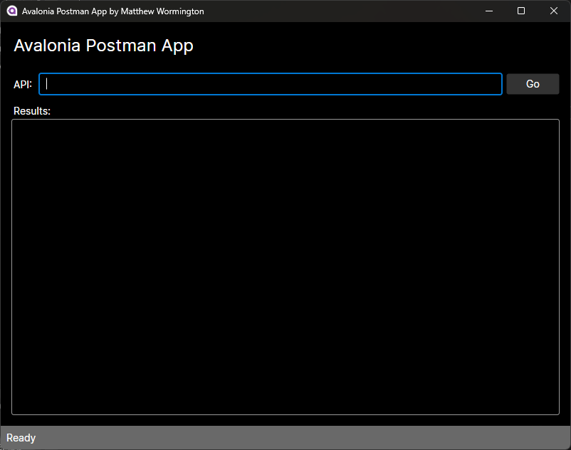
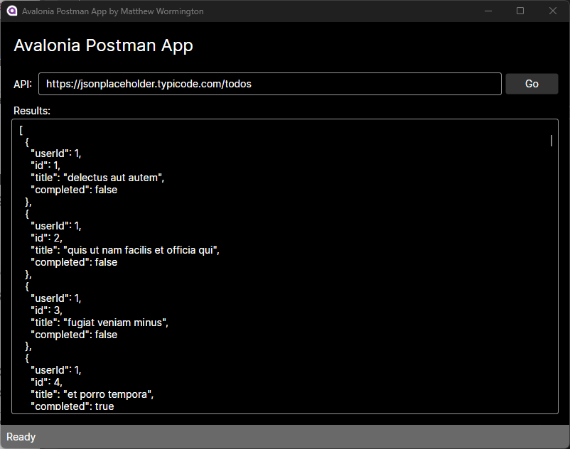

# Avalonia Postman App

Avalonia Postman Clone provides a cross-platform and user-friendly interface for making requests to APIs and viewing the responses in formatted JSON. Ideal for developers and testers, the tool simplifies API interaction and debugging, helping you efficiently validate and troubleshoot your API calls. The application can run on the desktop (Windows, Mac and Linux) as well as a web-browser. 

This is an example application inspired by the tutorial series by Tim Corey available on [YouTube](https://www.youtube.com/watch?v=FUqz2LF4BUs&list=PLLWMQd6PeGY3IxROaW7Hj8KFbRPg1x7mc). 

## Technologies Used
* C#
* .NET 8
* Avalonia
* HttpClient

# Using the App
1. Download the excecuatble file from the release section.
2. When the application launches, it should look like this:

3. Fill in your API URI and click the Go button

4. That's all folks!

Here are some simple examples to test each of the verbs supported by the application:

**GET**
URL: https://jsonplaceholder.typicode.com/posts/1
Body: 

**PUT**
URL: https://jsonplaceholder.typicode.com/posts/1
Body:
{
  "id": 1,
  "title": "This is our test title",
  "body": "This is our test body",
  "userid": 3
}

**PATCH**
URL: https://jsonplaceholder.typicode.com/posts/4
Body:
{
  "title": "This is our test title"
}

**DELETE**
URL: https://jsonplaceholder.typicode.com/posts/4
Body:

#  Features
**31 May 2024**
Added POST, PUT, PATCH and DELETE functionality

## To Do
* Add XML comments 
* Add light/dark theme selection
* Add API headers
* Add dependency injection
* Add logging

# Credits
* Tim Corey for the inspiration and training videos 
